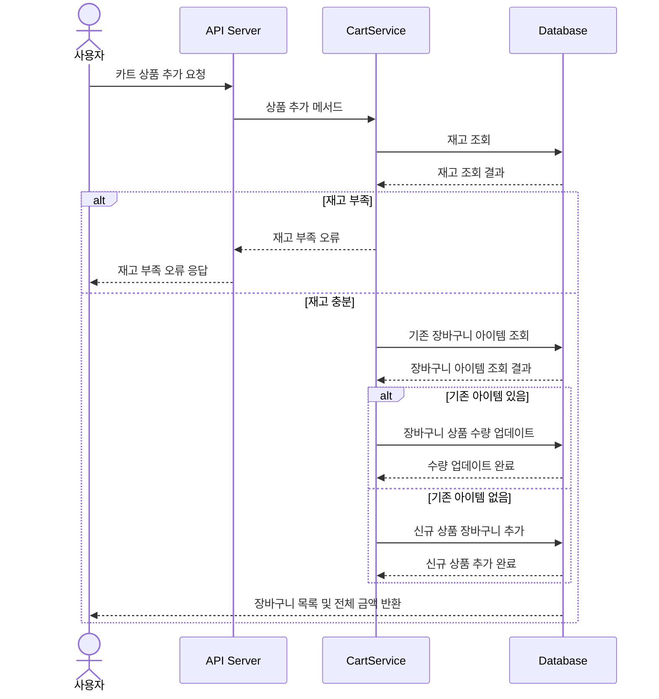

```mermaid
sequenceDiagram
    actor User as 사용자
    participant API as API Server
    participant Service as CartService
    participant DB as Database

    User ->> API: 카트 상품 추가 요청
    API ->> Service: 상품 추가 메서드

    Service ->> DB: 재고 조회
    DB -->> Service: 재고 조회 결과

    alt 재고 부족
        Service -->> API: 재고 부족 오류
        API -->> User: 재고 부족 오류 응답
    else 재고 충분
        Service ->> DB: 기존 장바구니 아이템 조회
        DB -->> Service: 장바구니 아이템 조회 결과

        alt 기존 아이템 있음
            Service ->> DB: 장바구니 상품 수량 업데이트
            DB -->> Service: 수량 업데이트 완료
        else 기존 아이템 없음
            Service ->> DB: 신규 상품 장바구니 추가
            DB -->> Service: 신규 상품 추가 완료
        end
        DB -->> User: 장바구니 목록 및 전체 금액 반환
    end
```