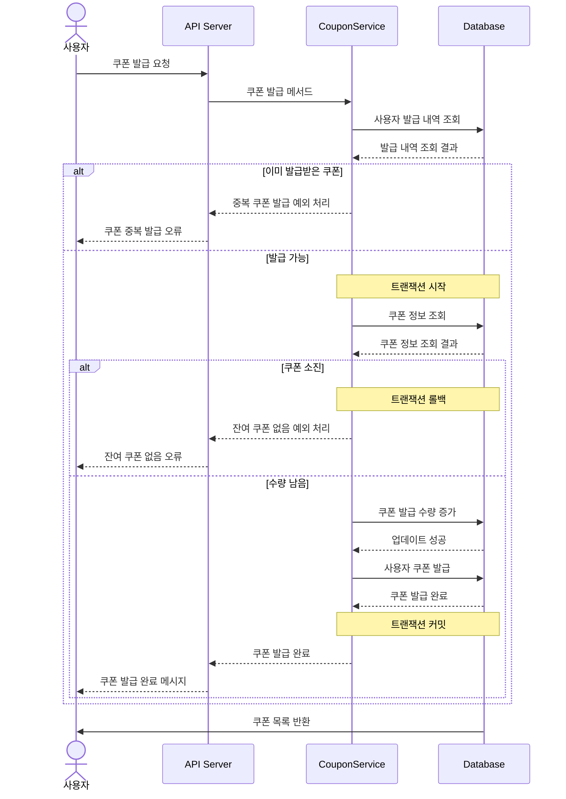

```mermaid
sequenceDiagram
  actor User as 사용자
  participant API as API Server
  participant Service as CouponService
  participant DB as Database

  User ->> API: 쿠폰 발급 요청
  API ->> Service: 쿠폰 발급 메서드
  
  Service ->> DB: 사용자 발급 내역 조회
  DB -->> Service: 발급 내역 조회 결과
  
  alt 이미 발급받은 쿠폰
    Service -->> API: 중복 쿠폰 발급 예외 처리
    API -->> User: 쿠폰 중복 발급 오류
    
  else 발급 가능
    Note over Service, DB: 트랜잭션 시작
    
    Service ->> DB: 쿠폰 정보 조회
    DB -->> Service: 쿠폰 정보 조회 결과
    
    alt 쿠폰 소진
      Note over Service, DB: 트랜잭션 롤백
      Service -->> API: 잔여 쿠폰 없음 예외 처리
      API -->> User: 잔여 쿠폰 없음 오류
      
    else 수량 남음
      Service ->> DB: 쿠폰 발급 수량 증가
      DB -->> Service: 업데이트 성공
      
      Service ->> DB: 사용자 쿠폰 발급
      DB -->> Service: 쿠폰 발급 완료
      
      Note over Service, DB: 트랜잭션 커밋
      Service -->> API: 쿠폰 발급 완료
      API -->> User: 쿠폰 발급 완료 메시지
    end
  end
DB ->> User: 쿠폰 목록 반환

```

