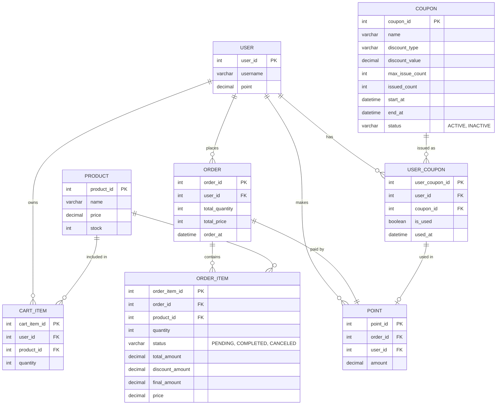

```mermaid
erDiagram
    USER ||--o{ CART_ITEM : owns
    USER ||--o{ ORDER : places
    USER ||--o{ USER_COUPON : has
    USER ||--o{ POINT : makes

    PRODUCT ||--o{ CART_ITEM : "included in"

    ORDER ||--o{ ORDER_ITEM : contains
    PRODUCT ||--o{ ORDER_ITEM : "ordered as"
    ORDER ||--|| POINT : "paid by"

    COUPON ||--o{ USER_COUPON : "issued as"
    USER_COUPON ||--o| POINT : "used in"

    USER {
        int user_id PK
        varchar username
        decimal point
    }

    PRODUCT {
        int product_id PK
        varchar name
        decimal price
        int stock
    }

    CART_ITEM {
        int cart_item_id PK
        int user_id FK
        int product_id FK
        int quantity
    }

    ORDER {
        int order_id PK
        int user_id FK
        int total_quantity
        int total_price
        datetime order_at
    }

    ORDER_ITEM {
        int order_item_id PK
        int order_id FK
        int product_id FK
        int quantity
        varchar status "PENDING, COMPLETED, CANCELED"
        decimal total_amount
        decimal discount_amount
        decimal final_amount
        decimal price
    }

    COUPON {
        int coupon_id PK
        varchar name
        varchar discount_type
        decimal discount_value
        int max_issue_count
        int issued_count
        datetime start_at
        datetime end_at
        varchar status "ACTIVE, INACTIVE"
    }

    USER_COUPON {
        int user_coupon_id PK
        int user_id FK
        int coupon_id FK
        boolean is_used
        datetime used_at
    }

    POINT {
        int point_id PK
        int order_id FK
        int user_id FK
        decimal amount
    }
```