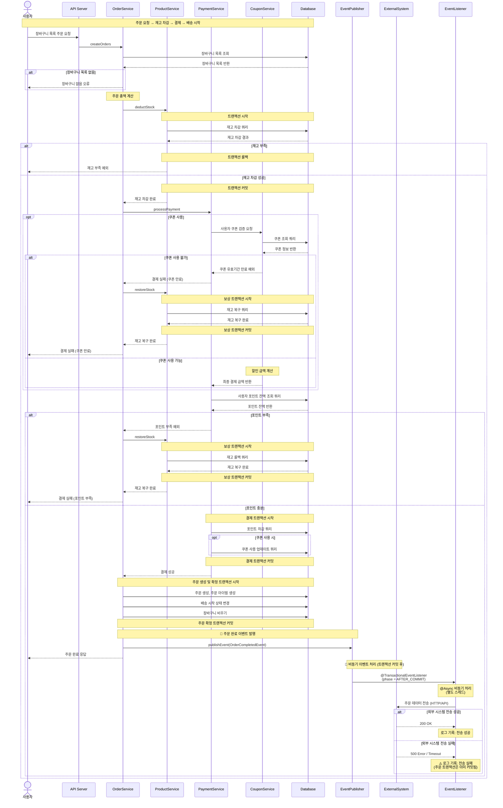

```mermaid
sequenceDiagram
    actor User as 사용자
    participant API as API Server
    participant OrderService as OrderService
    participant ProductService as ProductService
    participant PaymentService as PaymentService
    participant CouponService as CouponService
    participant DB as Database

    Note over User, DB: 주문 요청 → 재고 차감 → 결제 → 배송 시작

    User ->> API: 장바구니 목록 주문 요청
    API ->> OrderService: createOrders
    
    OrderService ->> DB: 장바구니 목록 조회
    DB -->> OrderService: 장바구니 목록 반환

    alt 장바구니 목록 없음
        OrderService -->> User: 장바구니 없음 오류
    end

    Note over OrderService: 주문 총액 계산

    OrderService ->> ProductService: deductStock

    Note over ProductService, DB: 트랜잭션 시작

    ProductService ->> DB: 재고 차감 쿼리
    DB -->> ProductService: 재고 차감 결과

    alt 재고 부족
        Note over ProductService, DB: 트랜잭션 롤백
        ProductService -->> User: 재고 부족 예외

    else 재고 차감 성공
        Note over ProductService, DB: 트랜잭션 커밋

        ProductService -->> OrderService: 재고 차감 완료

        OrderService ->> PaymentService: processPayment

        opt 쿠폰 사용
            PaymentService ->> CouponService: 사용자 쿠폰 검증 요청
            CouponService ->> DB: 쿠폰 조회 쿼리
            DB -->> CouponService: 쿠폰 정보 반환

            alt 쿠폰 사용 불가
                CouponService -->> PaymentService: 쿠폰 유효기간 만료 예외
                PaymentService -->> OrderService: 결제 실패 (쿠폰 만료)

                OrderService ->> ProductService: restoreStock

                Note over ProductService, DB: 보상 트랜잭션 시작

                ProductService ->> DB: 재고 복구 쿼리
                DB -->> ProductService: 재고 복구 완료
                Note over ProductService, DB: 보상 트랜잭션 커밋

                ProductService -->> OrderService: 재고 복구 완료

                OrderService -->> User: 결제 실패 (쿠폰 만료)

            else 쿠폰 사용 가능
                Note over CouponService: 할인 금액 계산
                CouponService -->> PaymentService: 최종 결제 금액 반환
            end
        end

        PaymentService ->> DB: 사용자 포인트 잔액 조회 쿼리
        DB -->> PaymentService: 포인트 잔액 반환

        alt 포인트 부족
            PaymentService -->> OrderService: 포인트 부족 예외
            OrderService ->> ProductService: restoreStock
            Note over ProductService, DB: 보상 트랜잭션 시작

            ProductService ->> DB: 재고 롤백 쿼리
            DB -->> ProductService: 재고 복구 완료
            Note over ProductService, DB: 보상 트랜잭션 커밋

            ProductService -->> OrderService: 재고 복구 완료

            OrderService -->> User: 결제 실패 (포인트 부족)

        else 포인트 충분
            Note over PaymentService, DB: 결제 트랜잭션 시작

            PaymentService ->> DB: 포인트 차감 쿼리

            opt 쿠폰 사용 시
                PaymentService ->> DB: 쿠폰 사용 업데이트 쿼리
            end

            Note over PaymentService, DB: 결제 트랜잭션 커밋

            PaymentService -->> OrderService: 결제 성공

            Note over OrderService, DB: 주문 생성 및 확정 트랜잭션 시작

            OrderService ->> DB: 주문 생성, 주문 아이템 생성
            OrderService ->> DB: 배송 시작 상태 변경
            OrderService ->> DB: 장바구니 비우기
            Note over OrderService, DB: 주문 확정 트랜잭션 커밋

            Note over OrderService, EventPublisher: 📢 주문 완료 이벤트 발행
            OrderService ->> EventPublisher: publishEvent(OrderCompletedEvent)

            OrderService -->> User: 주문 완료 응답

            Note over EventPublisher, ExternalSystem: 🔄 비동기 이벤트 처리 (트랜잭션 커밋 후)

            EventPublisher ->> EventListener: @TransactionalEventListener<br/>(phase = AFTER_COMMIT)

            Note over EventListener: @Async 비동기 처리<br/>(별도 스레드)

            EventListener ->> ExternalSystem: 주문 데이터 전송 (HTTP/API)

            alt 외부 시스템 전송 성공
                ExternalSystem -->> EventListener: 200 OK
                Note over EventListener: 로그 기록: 전송 성공

            else 외부 시스템 전송 실패
                ExternalSystem -->> EventListener: 500 Error / Timeout
                Note over EventListener: ⚠️ 로그 기록: 전송 실패<br/>(주문 트랜잭션은 이미 커밋됨)
            end
        end
    end
```